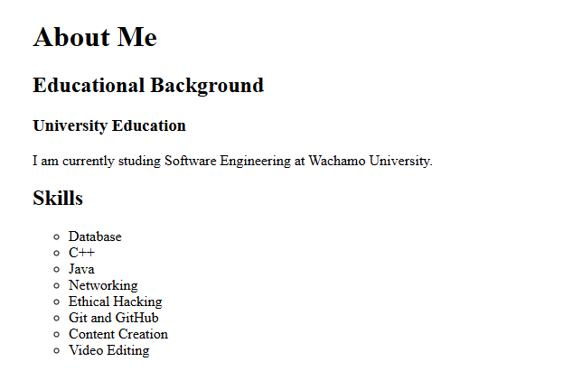
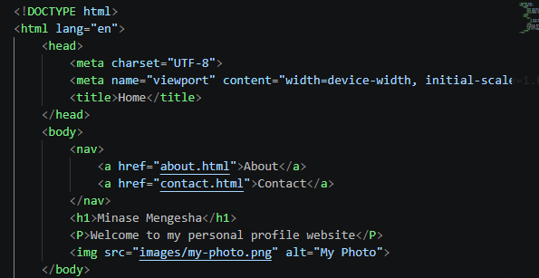
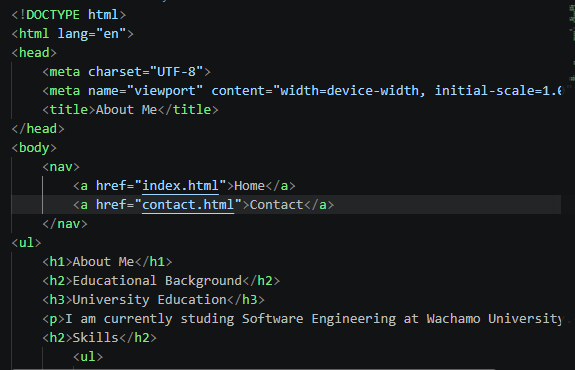
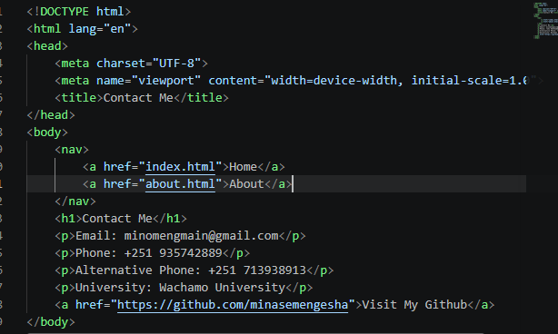

# My Profile

A three-page personal profile website built using HTML.

## Pages

- Home
- About
- Contact

## Technologies

- HTML5

## Project Structure

- index.html — Home page
- about.html — About page
- contact.html — Contact page
- images/ — Website images

## images

### Home

### About

### Contact

### Code Sample From Home

### Code Sample From About

### Code Sample From Contact

## 📜 License

This project is licensed under the MIT License — see the [LICENSE](LICENSE) file for details.